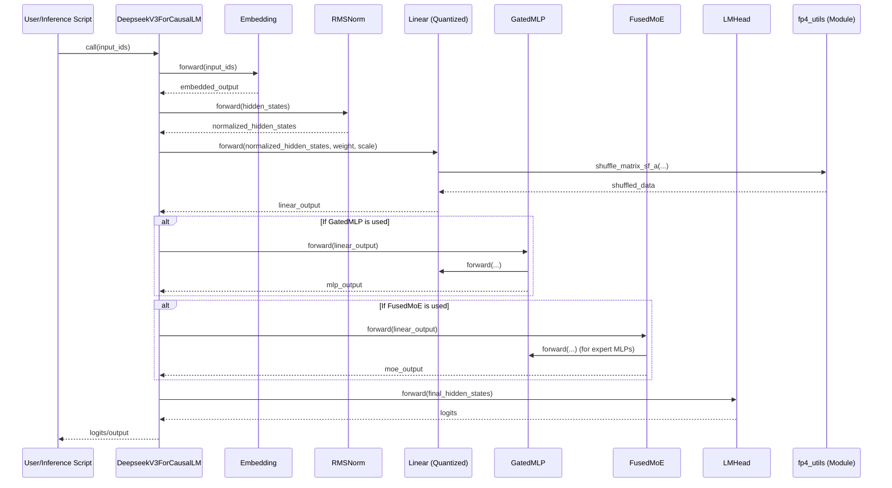
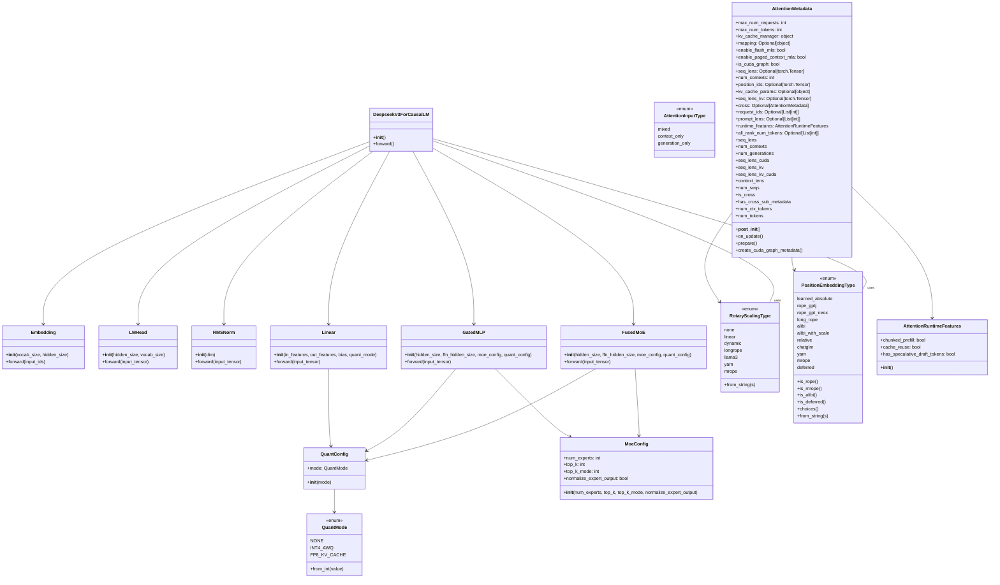

# DeepSeek FP4 推理插件 - 技术文档

## 概述

本技术文档旨在提供 DeepSeek FP4 推理插件的详细技术概览。该插件是从 TensorRT-LLM 项目中提取并独立出来的，专注于为 DeepSeek 模型提供高效的 FP4 量化推理功能，包括自定义的 CUDA 内核操作。

本插件的核心目标是提供一个独立的、易于集成的 PyTorch 解决方案，用于处理 DeepSeek 模型的 FP4 量化推理，而无需完整的 TensorRT-LLM 依赖。

## 核心组件

DeepSeek FP4 推理插件主要包含以下核心组件：

*   **模型定义 (`deepseek_v3.py`)**: 包含了 DeepSeekV3 模型的结构定义。
*   **模块 (`modules/`)**: 包含了像 `Linear` (支持 FP4 量化)、`RMSNorm`、`GatedMLP` 和 `FusedMoE` 等核心神经网络层。
*   **量化工具 (`quantization/`)**: 提供了 FP4 量化相关的实用函数，例如权重处理和块尺度交错。
*   **配置 (`configs/`)**: 定义了模型、量化和注意力机制的配置类，如 `QuantConfig`, `MoeConfig`, `AttentionMetadata` 等。

## 程序时序图

以下时序图展示了 DeepSeek FP4 推理插件中，从用户调用模型到最终输出 logits 的关键组件之间的交互流程。

**时序图说明**：

该时序图展示了推理请求在插件中的数据流。它从用户或推理脚本开始，通过 `DeepseekV3ForCausalLM` 模型，依次调用 `Embedding`、`RMSNorm`、`Linear` 等层。其中，`Linear` 层会与 `fp4_utils` 模块交互进行 FP4 相关的权重处理。根据模型配置，可能会通过 `GatedMLP` 或 `FusedMoE` 层。最终，数据流向 `LMHead` 层生成 logits，并返回给用户。

## 类图

以下类图展示了 DeepSeek FP4 推理插件中主要类之间的结构和关系。它描绘了核心组件，如模型类、神经网络层和配置类。

**类图说明**：

该类图展示了插件中主要 Python 类之间的关系。实线箭头表示依赖关系（例如，一个类使用另一个类），虚线箭头表示继承关系（如果存在）。图中包含了模型、层、量化和注意力配置等关键组件，帮助理解插件的整体架构。

## 未来工作

*   **完善 FP4 量化内核**：当前 `fp4_utils.py` 中的 `pack_int4_weight_col_wise` 等函数是简化实现，未来可以集成更高效的 CUDA 内核以充分利用 FP4 量化优势。
*   **扩展模型支持**：未来可以扩展对 DeepSeek 系列中其他模型或相关模型的支持。
*   **集成更多优化**：例如，支持更多的注意力机制优化、并行策略等。 