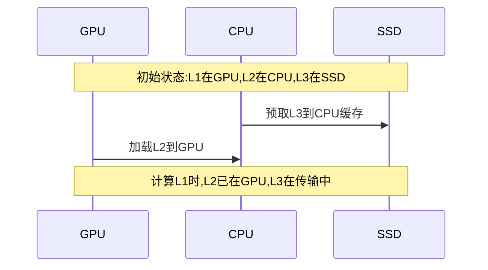

# DeepSeek FP4 推理插件 - 技术优化文档

## 1. 整体架构

### 1.1 分层内存架构
```
┌─────────────────┐
│    GPU (16GB)   │ ← 活跃层和专家
├─────────────────┤
│    CPU (96GB)   │ ← 缓存层和专家权重
├─────────────────┤
│ SSD (400GB/14G/s)│ ← 完整模型权重
└─────────────────┘
```

### 1.2 核心组件
- 内存管理器(MemoryManager)
- 预取系统(PrefetchSystem)  
- 专家路由器(ExpertRouter)
- 计算调度器(ComputeScheduler)

## 2. 关键优化技术

### 2.1 动态层管理

```python
class LayerManager:
    def __init__(self):
        self.gpu_layers = {}     # 当前在GPU的层
        self.cpu_cache = {}      # CPU缓存的层
        self.active_experts = {} # 活跃专家集合
        
    def schedule_layers(self, current_layer):
        # 预测下一层所需内存
        next_layer_mem = self.estimate_layer_memory(current_layer + 1)
        
        # 根据可用显存决定是否需要卸载
        if self.gpu_free_memory < next_layer_mem:
            self.offload_inactive_layers()
            
        # 预取即将需要的层
        self.prefetch_next_layers(current_layer)
```

### 2.2 智能预取策略

#### 双缓冲预取


#### 自适应批次
- 动态调整预取数量
- 基于历史访问模式
- 考虑带宽限制

### 2.3 专家(MoE)优化

#### 专家缓存策略
```python
def manage_experts(self, router_logits):
    # 计算专家激活概率
    expert_probs = torch.sigmoid(router_logits)
    
    # 选择激活专家
    active_experts = expert_probs > self.expert_threshold
    
    # 预加载高概率专家
    for expert_id in active_experts:
        if expert_id not in self.gpu_experts:
            self.load_expert(expert_id)
    
    # 卸载低使用率专家
    self.offload_inactive_experts()
```

#### 路由优化
- 组级别的专家选择
- 预分配显存配额
- 动态权重阈值

### 2.4 IO优化

#### PCIe带宽利用
- 异步数据传输
- 压缩传输
- 流水线重叠

#### 计算流管理
```python
class StreamManager:
    def __init__(self):
        self.compute_stream = torch.cuda.Stream()
        self.copy_stream = torch.cuda.Stream()
        self.prefetch_stream = torch.cuda.Stream()
        
    def schedule(self):
        with torch.cuda.stream(self.prefetch_stream):
            self.prefetch_next_batch()
            
        with torch.cuda.stream(self.compute_stream):
            self.process_current_batch()
            
        with torch.cuda.stream(self.copy_stream):
            self.transfer_results()
```

## 3. 内存优化配置

### 3.1 GPU内存配置
- 最小保留: 2GB(系统)
- 活跃层: 8GB(可配置)
- 专家缓存: 4GB(动态)
- 计算缓存: 2GB(固定)

### 3.2 CPU内存配置 
- 模型权重: 40GB
- 层缓存: 32GB
- 预取缓存: 16GB
- 系统预留: 8GB

### 3.3 SSD配置要求
- 带宽: ≥12GB/s
- 容量: ≥400GB
- 随机读: ≥100K IOPS
- 延迟: ≤100μs

## 4. 性能调优指南

### 4.1 低延迟配置
```yaml
memory_config:
  max_gpu_layers: 2
  prefetch_layers: 1
  expert_threshold: 0.2
  min_batch_size: 1
  
compute_config:
  enable_fusion: true
  overlap_io: true
  use_cuda_graph: true
```

### 4.2 高吞吐配置
```yaml
memory_config:
  max_gpu_layers: 4
  prefetch_layers: 2
  expert_threshold: 0.1
  max_batch_size: 32
  
compute_config:
  enable_fusion: true
  overlap_compute: true
  use_parallel_compute: true
```

### 4.3 平衡配置
```yaml
memory_config:
  max_gpu_layers: 3
  prefetch_layers: 2
  expert_threshold: 0.15
  dynamic_batch: true
  
compute_config:
  enable_fusion: true
  auto_tune: true
  adaptive_schedule: true
```

## 5. 监控与调试

### 5.1 性能指标
- GPU利用率
- 内存使用
- PCIe带宽
- 计算延迟
- 预取命中率

### 5.2 调试工具
- 内存追踪
- 专家统计
- 带宽分析
- 延迟分析

## 6. 最佳实践

### 6.1 硬件选择
- GPU: A100/H100 (16GB+)
- CPU: 96GB+ 内存
- SSD: PCIe 5.0 NVMe

### 6.2 配置优化
- 根据负载特征选择配置模板
- 监控关键指标进行微调
- 定期评估和优化性能

### 6.3 常见优化场景

#### 场景1: 高并发API服务
- 增加批处理大小
- 优化预取策略
- 使用多流并行

#### 场景2: 单次请求延迟敏感
- 减少层切换
- 提高专家阈值
- 启用CUDA图优化

#### 场景3: 内存受限环境
- 增加SSD缓存使用
- 减少活跃专家数量
- 优化预取策略